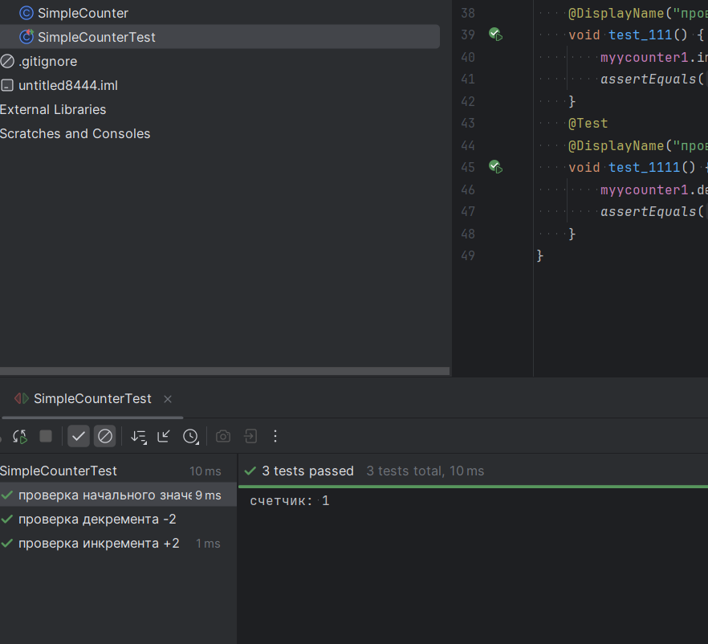
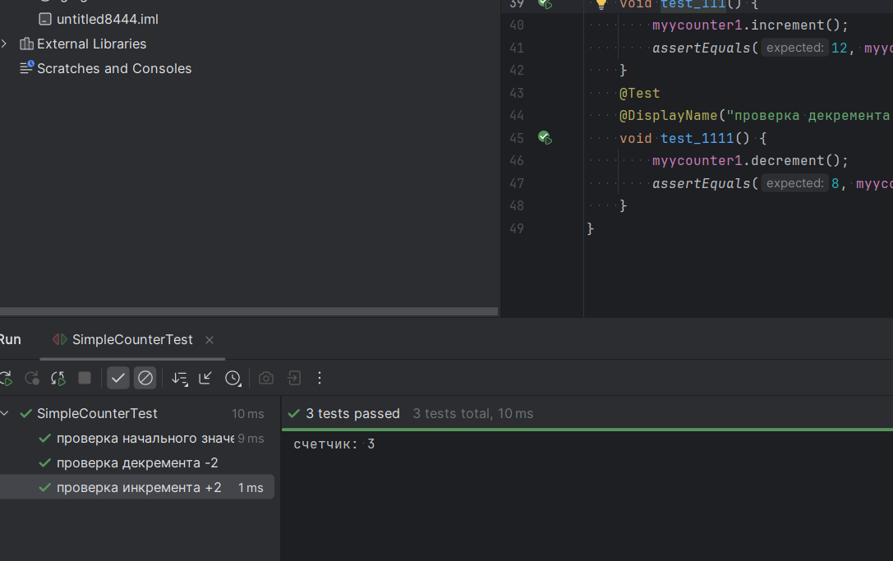
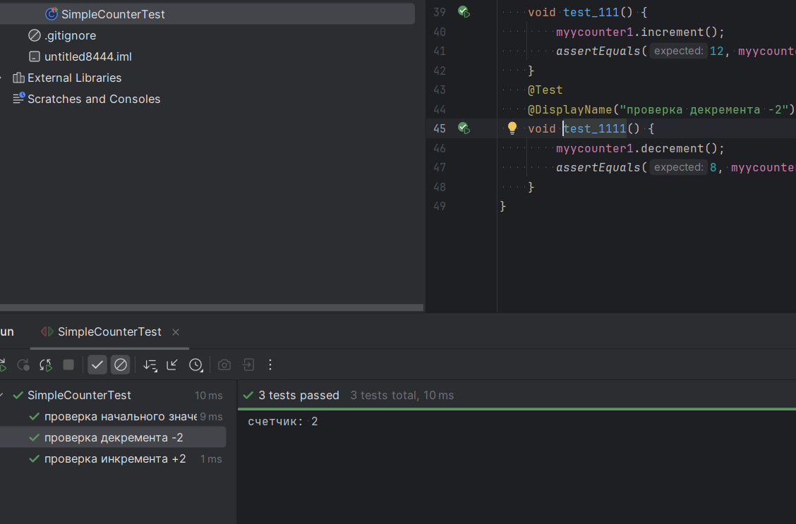
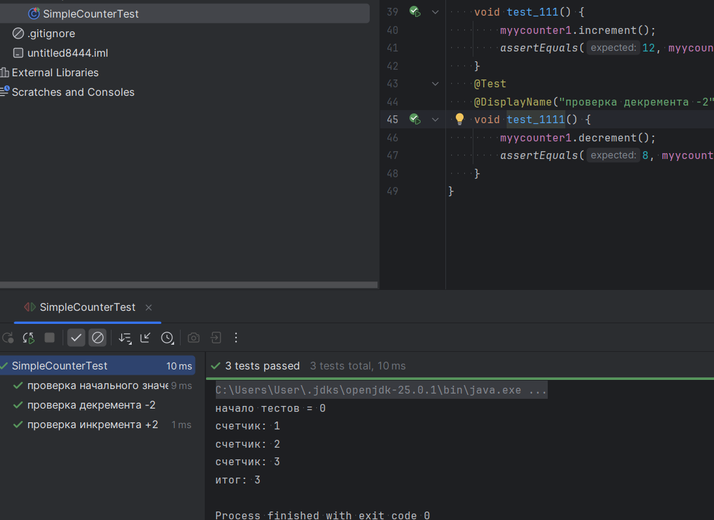
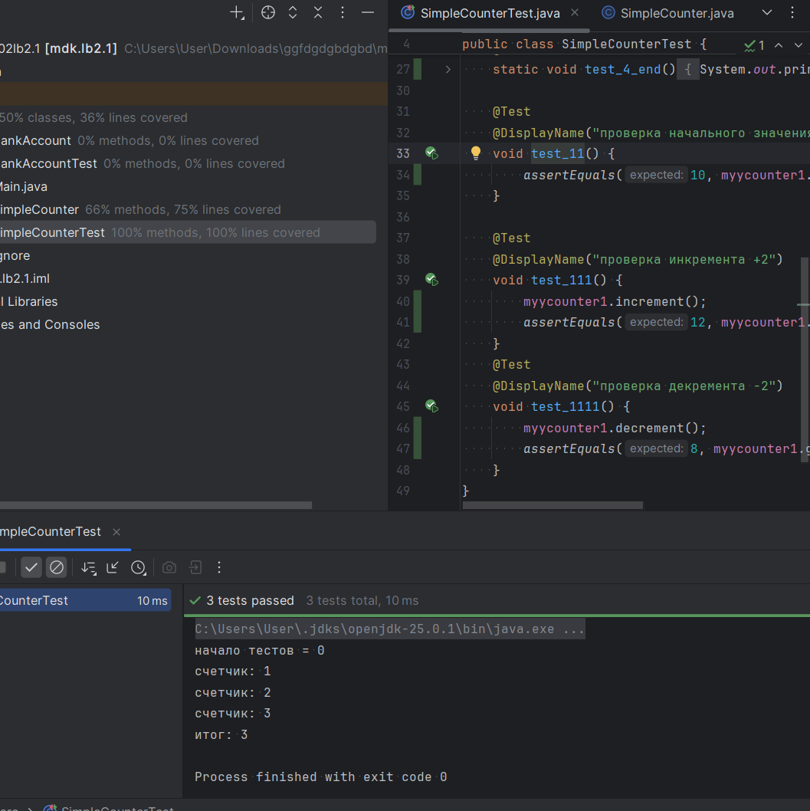
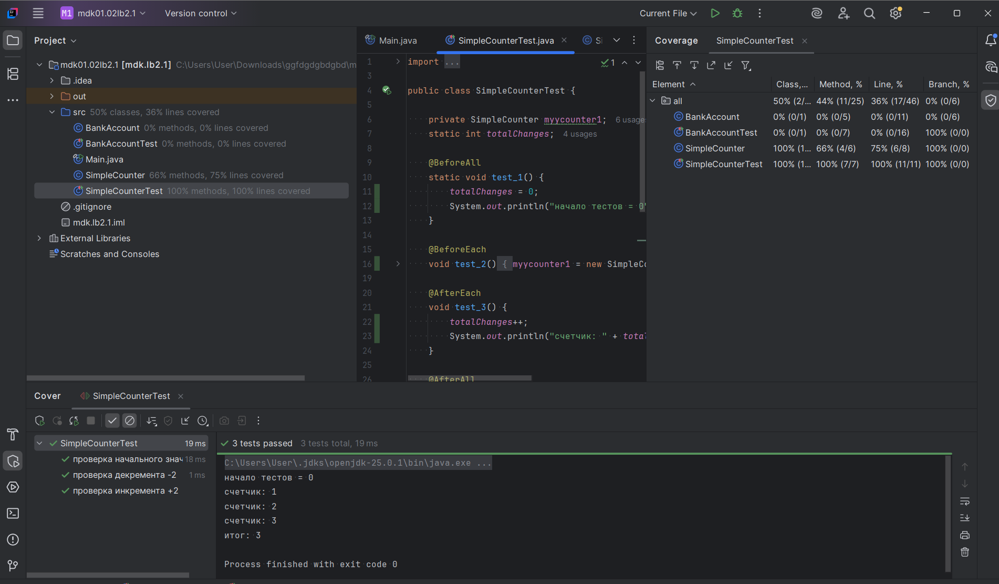

# Лабораторная работа №2_1: Тестовое окружение в JUnit

## 👨‍🎓 Студент
- **ФИО:** Шабатин Тимур Марселевич 
- **Группа:** ИС-247
- **Вариант:** 22 Простой счетчик (SimpleCounter)

---

## ✅ Выполненные задания
### Задание 1 (Простое)
**Тест:** Используйте @BeforeEach для создания счетчика с начальным значением 10 и шагом 2. Проверьте начальное значение.

### Задание 2 (Среднее)
**Тесты:** Проверьте операции счетчика. Напишите два теста с использованием @BeforeEach:
Инкремент (значение становится 12).
Декремент (значение становится 8).

### Задание 3 (Сложное)
**Тест:** : Введите статический счетчик totalChanges (общее количество изменений счетчика). С помощью @BeforeAll инициализируйте счетчик = 0. Каждый вызов increment или decrement должен увеличивать счетчик на 1. С помощью @AfterEach проверяйте увеличение счетчика. С помощью @AfterAll выведите общее количество изменений.

---

## 📊 Результаты

---

## 📎 Ссылки
- [Код тестов](SimpleCounterTest.java)
- [Основной класс](SimpleCounter.java)

*Дата: 16.03.2026*
